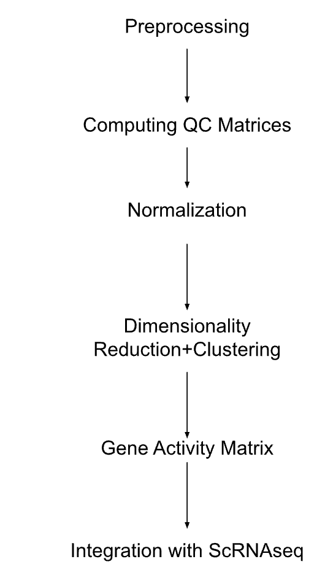
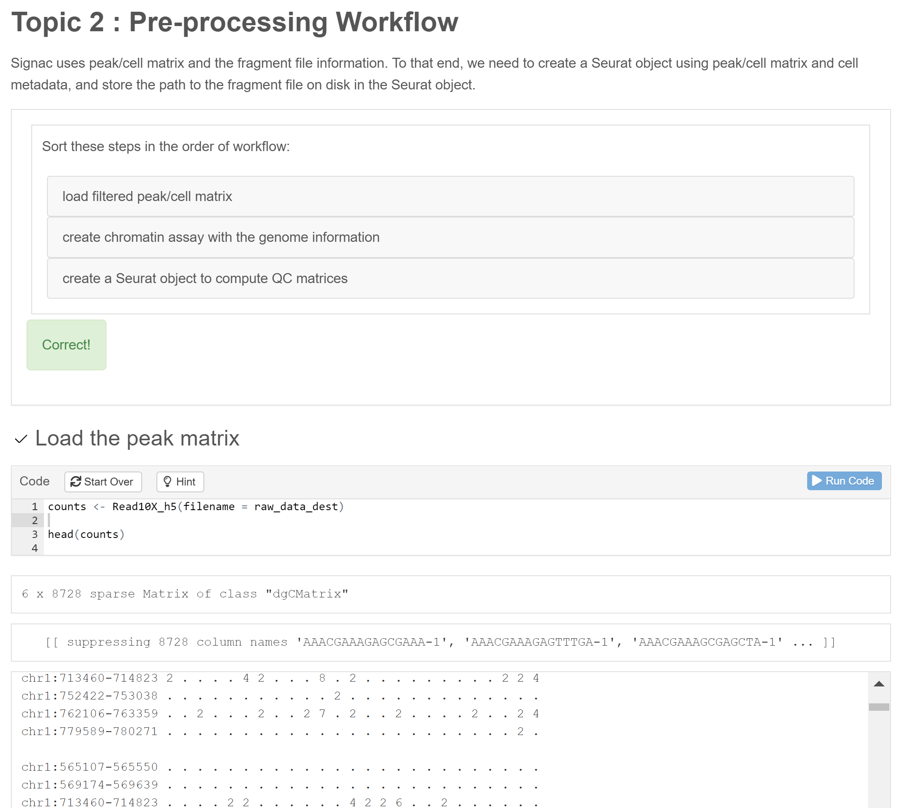
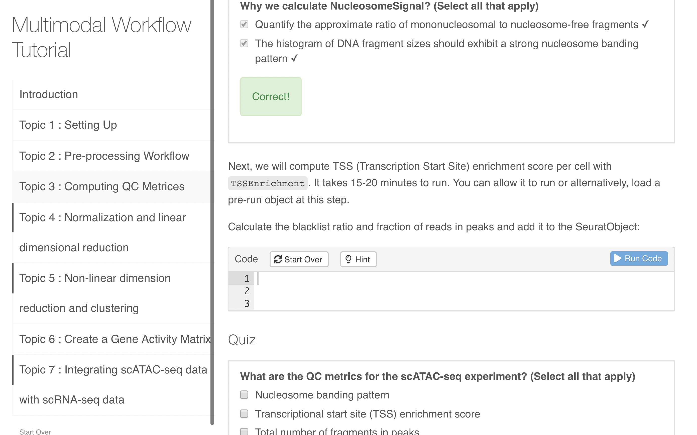

# BiocSwirl

## Table of Contents

-   [Structure](#structure)
    -   [Background](#background-background)
    -   [Data](#data-data)
    -   [Usage](#usage-usage)
        -   [Installation](#installation-installation)
        -   [Requirements](#requirements-requirements) 
        -   [Steps to run](#steps-to-run-steps-to-run) 
    -   [Contributions and Skills Gained](#contributions)
    -   [Team Members](#team-members-team-members)
    -   [Screen Shots](#screenshots-screenshots)

## Background {#Background}

Bioinformatics is an emerging interdisciplinary field that incorporates biological, statistical and computer science based knowledge to provide in-depth analysis and interpretation of biological data. There are a number of resources available to individuals interested in learning bioinformatics and these include: workshops, videos,and online tutorials. However, workshops can be time limiting, videos lack the ability to troubleshoot, and online tutorials can lack meaningful feedback and interactivity aside from copying and pasting codes. Our project seeks to create an interactive lesson using the learnR format and aims to provide a user-friendly and interactive learning environment that allows students to learn at their own pace.

For this hackathon we adapted the [Analyzing PBMC scATAC-seq tutorial](https://satijalab.org/signac/articles/pbmc_vignette.html) from the Satija Lab into a more interactive LearnR format. This tutorial looks at the analysis of single cell ATAC-seq data of human peripheral blood mononuclear cells collected on the 10X Genomics Platform. Single cell ATAC-seq (Assay for Transposase Accessible Chromatin with high-throughput sequencing) is a method that looks at open chromatin regions at the genome level at a single cell resolution. Our lessons aim to teach learners not only the background of this technology, but also the analysis of this data type from preprocessing to integrating with scRNAseq data. More information is included in the workflow from the diagram below.



## Data {#data}

The data used is from the 10X genomics website. It contains a single-cell ATAC-seq dataset of human peripheral blood mononuclear cells (PBMCs). The files below will be downloaded by the tutorial itself, so there is no need to download it.

-   [The Raw data](https://cf.10xgenomics.com/samples/cell-atac/1.0.1/atac_v1_pbmc_10k/atac_v1_pbmc_10k_filtered_peak_bc_matrix.h5)
-   [The Metadata](https://cf.10xgenomics.com/samples/cell-atac/1.0.1/atac_v1_pbmc_10k/atac_v1_pbmc_10k_singlecell.csv)
-   The [fragments file](https://cf.10xgenomics.com/samples/cell-atac/1.0.1/atac_v1_pbmc_10k/atac_v1_pbmc_10k_fragments.tsv.gz) 
-   The [fragments file index](https://cf.10xgenomics.com/samples/cell-atac/1.0.1/atac_v1_pbmc_10k/atac_v1_pbmc_10k_fragments.tsv.gz.tbi) 
-   The [ScRNASeq file](https://signac-objects.s3.amazonaws.com/pbmc_10k_v3.rds)

## Usage {#usage}

### Installation {#installation}

Installation requires fetching the source code and opening the file in R studio using the Run Document Function. Following are required:

-   Git
-   Rstudio

To fetch source code, change in to directory of your choice and run:

``` sh
git clone -b main 
   git@github.com:u-brite/BiocSwirl.git
```

### Requirements {#requirements}

*OS:*

Works in all Operating Systems R studio can be run in.

*Tools:*

*R*: 
- R version (4.0.3 or higher)

*Rstudio*:

-   RStudio 2022.07.1+554 "Spotted Wakerobin" Release equivalent or higher

*Packages Required for R*:

-   LearnR
-   Seurat
-   Signac
-   ggplot2
-   GenomeInfoDb
-   EnsDb.Hsapiens.v75
-   hdf5r
-   sortable

### Steps to run {#steps-to-run}

1.  Clone Git Repo

2.  Hit Run Document

3.  Wait for file to download data sets and then proceed with tutorial

## Contributions and Skills Gained {#Contributions-and-Skills-Gained}

### Contributions

| Name  | Contribution | Skills Gained|
| ------------- | ------------- | ------------- |
| Almas Khan  | writing the Readme (all sections),Finding and reading background papers for scATAC-seq,Creating workflow figure , Wrote code for downloading files and troubleshooting major errors in learnR document,fixing errors and finalizing the Rmd and learnR document,demonstrating troubleshooting process,teaching members about github and R studio | interactive tutorial with learnR, scATAC-seq,delegation and learning to lead a hackathon team|
| Sayan Bakshi|Completed the scATAC-seq and multimodal workflow with scRNA-seq from the original tutorial,Performed background literature study on the topic,Devised questions, quizzes, exercises for 3 of the 7 sections,Coded the complete tutorial in R with learnR, helped with troubleshooting, proof-reading, and  changes (e.g. adding descriptions) in the interactive course| R markdown (intermediate); scATAC-seq analysis (beginner), Multi-omics by combining scATAC-seq with scRNA-seq (beginner), learnR (intermediate), learnR-based interactive course making for teaching purposes (beginner)|
|Kingsley Bentum|Writing the introductory part of the learnR lesson and providing relevant materials needed for the lesson, Submission of exercises, quizzes , proof-reading of the summary document|R markdown (beginner), scATAC-seq analysis  Multi-omics by combining scATAC-seq with scRNA-seq (beginner), learnR (beginner), learnR-based interactive course making for teaching purposes (beginner)|
|Yong Wang|Finish reading background papers on  scATAC-seq ,Completed the scATAC-seq and multimodal workflow with scRNA-seq from the original tutorial,Develop questions, quizzes, exercises for 4 of the 7 sections,perform some practice on the coding of interactive tutorial with learnr in rmd file|scATAC-seq analysis (beginner),R Markdown (beginner),Multi-omics analyses by combining scATAC-seq with scRNA-seq by using Signac, Seurat packages (beginner),Interactive Tutorial with learnr (beginner),Git and GitHub (beginner)|
|Lisa Natasha Cao|helping with troubleshooting|


## Team Members {#team-members}

Almas Khan | [almas.khan2\@outlook.com](mailto:almas.khan2@outlook.com) | Github:almas2019 |Team Leader|

Yong Wang| [yongwnet70\@gmail.com](mailto:yongwnet70@gmail.com)|Github:yongwnet70| Member|

Sayan Bakshi | [sbakshi\@uab.edu](mailto:sbakshi@uab.edu)|Github:bakshisayan|Member|

Kingsley Emmanuel Bentum | [kbentum8786\@tuskegee.edu](mailto:kbentum8786@tuskegee.edu)|Github:Drkbentum|Member|

Lisa Natasha Cao |[lisanatashaca\@gmail.com](mailto:lisanatashacao@gmail.com)|Github:lisancao|Member

## Screenshots (#screenshots)




